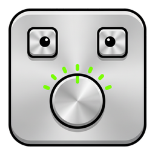
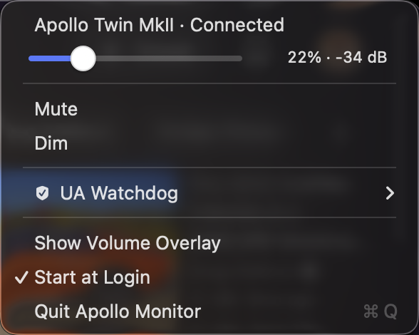

# Apollo Monitor

<p align="center"></p>



A macOS menu-bar control for the **monitor output level of a Universal Audio
Apollo**: a live level arc in the menu bar, a horizontal slider, connection
status, the Mac's **volume keys** remapped to drive it in 1 dB steps, and a volume
overlay to replace the one macOS cannot make work.

Built on [StatusItemKit](https://github.com/nicholaspsmith/StatusItemKit) and
[HotkeyKit](https://github.com/nicholaspsmith/HotkeyKit).

```
┌────────────────────────────────┐
│  Apollo Twin MkII · Connected  │
│  ───●───────────  13% · -47 dB │
├────────────────────────────────┤
│  Mute                          │
│  Dim                           │
│  Show Volume Overlay         ✓ │
│  Start at Login              ✓ │
│  Quit Apollo Monitor        ⌘Q │
└────────────────────────────────┘
```

## The menu-bar icon


A green arc whose filled length is the monitor level, drawn by
[`MeterIcon`](https://github.com/nicholaspsmith/StatusItemKit) at 18pt. It follows
the level live, including changes made on the Apollo's own knob or in Console.

It turns **grey whenever the level cannot be changed** — the mixer engine is not
running, the Apollo is offline, the output is muted, or Accessibility has not been
granted yet. The menu says which.

Being green means it is a full-colour image rather than a template, so unlike most
menu-bar glyphs it keeps its colour instead of inverting when the menu opens.

## Why this exists

The Apollo exposes **no volume control to Core Audio at all** — no
`kAudioDevicePropertyVolumeScalar`, no virtual main volume, and
`osascript -e 'get volume settings'` reports `output volume: missing value`. So
the macOS volume keys, `set volume`, and every hardware-volume utility are
useless on it, even when the Apollo is the default output device. UAD Console
also ships no AppleScript dictionary and no volume key commands.

The level can only be changed by opening Console or reaching for the knob — until
now.

## How it works

`UA Mixer Engine.app` starts at login and listens on **TCP `127.0.0.1:4710`**,
speaking an undocumented path-based "StateTree" protocol. It is the same channel
UAD Console itself uses, and it listens whether or not the Console window is
open.

- Messages are `<verb> <path> [value]` terminated by a **NUL byte** (`0x00`).
  A newline is silently ignored, which makes the socket look dead.
- Verbs: `get`, `set`, `subscribe`, `unsubscribe`.
- Replies are JSON: `{"path": …, "data": …}` or `{"path": …, "error": …}`.
- `subscribe` returns the current value **and pushes every later change**, so the
  menu bar follows the hardware knob and Console's fader live, with no polling.
- A `get` round-trips in ~3 ms; a `set` is echoed back in ~8 ms (median of 12).

Paths used (device 0; the `MONITOR` output is resolved by name, not hardcoded):

| Path | Type |
|---|---|
| `/devices/0/DeviceName/value` | string — e.g. `"Apollo Twin MkII"` |
| `/devices/0/DeviceOnline/value` | bool |
| `…/outputs/<n>/CRMonitorLevelTapered/value` | float 0.0–1.0, knob position |
| `…/outputs/<n>/CRMonitorLevel/value` | float −96.0–0.0, dB |
| `…/outputs/<n>/Mute/value`, `…/DimOn/value` | bool |

### The two properties are not equivalent

`CRMonitorLevelTapered` **snaps to a 1/54 grid** — a requested `0.05` reads back
as `0.055556` — and holds the same value across roughly a 2 dB span. It is a
coarse *report* of the knob's position, not the control itself.

`CRMonitorLevel` (dB) is the real, fine-grained control: `-29.5`, `-29.1` and
`-27.25` all round-trip exactly while the tapered value sits unchanged at 14/54.

So the two are used for different jobs:

- **The volume keys step dB**, 1 dB at a time, snapped onto the whole-dB ladder so
  a level left on a fraction by the hardware knob lands back on integers. Around
  normal listening levels one tapered grid step is ~2 dB, which makes 1 dB about
  0.9% of knob travel — finer than a single percentage point of the 0–100% scale,
  which cannot be expressed at all in only 55 hardware positions.
- **The slider sets knob position**, mirroring Console's knob. Its knob sits at the
  position the engine reports, continuously — the display is never quantised, so it
  always agrees with Console. Dragging writes whole percents; the engine snaps those
  to its 1/54 grid and pushes back the real position, which is then what is shown.
  So a drop at 26% can settle at 14/54, and the readout tells you so.

Nothing accumulates in either path — the keys compute an absolute dB, the slider an
absolute position from the mouse — so no canonical step ladder is needed to stop
drift. Conversions and the drag geometry are
[unit-tested](Tests/ApolloMonitorCoreTests/KnobPositionTests.swift).

0% is −96 dB (silence), 100% is 0 dB (unity).

## Install

```sh
git clone https://github.com/nicholaspsmith/StatusItemKit.git
git clone https://github.com/nicholaspsmith/HotkeyKit.git
git clone https://github.com/nicholaspsmith/apollo-monitor-menubar.git
cd apollo-monitor-menubar
../StatusItemKit/scripts/setup-signing.sh   # once, see below
./install.sh
```

The three checkouts must be siblings — `Package.swift` uses local paths.

Run `../StatusItemKit/scripts/setup-signing.sh` once before installing.
Ad-hoc signatures get a new code hash on every rebuild and macOS keys the
Accessibility grant to that hash, so without a stable identity you re-approve the
app after every build.

## Usage

| | |
|---|---|
| **Volume up / down keys** | Monitor level ±1 dB per press; a held key accelerates |
| **Mute key** | Mutes and unmutes the monitor output |
| Click the icon | Slider, Mute, Dim, overlay switch, [UA Watchdog](#ua-watchdog), Start at Login |
| `ApolloMonitor --step up\|down` | Adjust once and exit — needs no Accessibility |
| `ApolloMonitor --login on\|off\|status` | Start at Login, from the shell — what `install.sh` calls |

### The volume keys

The Mac's own volume and mute keys are taken over rather than some chord. On an
Apollo they otherwise do nothing useful: because the device has no Core Audio
volume, pressing them just raises the system HUD with a **greyed-out slider you
cannot move**. Swallowing the key suppresses that HUD too, so feedback comes from
the menu-bar level arc and the overlay.

The mute key toggles the Apollo's `Mute`, and is deliberately the one key that does
*not* repeat on hold — repeating it would flap the output on and off several times
a second. Muting changes no level, so the overlay is driven by mute state as well
as by dB; without that the mute key's only visible effect would be the menu-bar arc
turning grey.

### The overlay

Because the key is swallowed, the system's own volume HUD never appears — which is
no loss, since for a device with no Core Audio volume it could only show a slider
greyed out. A replacement overlay appears top-right below the menu bar, in the same
place, showing the device name, a level bar, and the exact dB. It is a
non-activating borderless panel so it never steals focus, ignores mouse events, and
fades after 1.4 s.

It follows the *level*, not the keypress, so turning the knob on the Apollo itself
or moving Console's fader raises the same readout. Dragging the menu slider does
not, since that is already its own feedback.

**Show Volume Overlay** in the menu turns it off and on; the choice persists. With
it off the menu-bar arc is still live, so the level remains visible without
anything appearing over your work.

The panel is rebuilt when the machine wakes, when the screen configuration changes,
or when the overlay has gone unused for five minutes. A long-running instance once
reached a state where every `show()` ran correctly and yet no window ever reached
the screen; restarting fixed it. The trigger was never reproduced, and a process
cannot reliably ask whether its own window is on screen —
`CGWindowListCopyWindowInfo` answers differently for the caller — so the window is
replaced across those transitions instead of repaired on detection. Rebuilding is
sub-millisecond and never happens during a run of key presses.

### Responsiveness

The event-tap callback does arithmetic and a socket write, nothing else. Drawing is
deferred to the next main-queue turn, so a keystroke never waits on a redraw — and
the tap cannot be disabled by the system for dawdling. The burst of state changes a
single press produces (the optimistic write, the engine's dB echo, its coarser
tapered echo) collapses into one UI pass instead of three.

The dB readout moves the instant a key is pressed; the slider's position waits for
the engine's echo, ~8 ms, because only the engine knows which of its 55 knob
positions the level landed on. Measured end to end, the app's own processing went
from a 68 ms median to 37 ms, with a floor of 1–7 ms.

A held key accelerates: 1 dB for the first few repeats, then 2, then 3. macOS
delivers media-key repeats about every 150 ms, so a flat 1 dB made crossing a useful
range take several seconds of holding; this crosses −60 → 0 dB in about two seconds
while a single press still moves exactly 1 dB.

### Pass-through

The volume keys are only intercepted while the Apollo is **the current default output
device**. Switch to the built-in speakers or a USB interface and the keys go
straight back to their normal behaviour, because those devices have their own
volume and macOS handles them properly. The menu says so when it is passing them
through. They also pass through whenever the engine is unreachable, so the keys
are never dead.

Bound to `NX_KEYTYPE_SOUND_UP` / `_DOWN` / `MUTE` (0, 1 and 7), each with and
without the `fn` modifier, since some keyboards report the function layer on media
keys.

This needs **Accessibility** permission (it is a `CGEventTap`); the menu and
slider do not. `--step` is the escape hatch if you would rather not grant it:
bind it from Shortcuts, Karabiner, or anything else that can run a command.

## UA Watchdog

`./install.sh` also installs a small LaunchAgent, `com.nicholassmith.ua-watchdog`,
which the menu's **UA Watchdog** submenu reports on and toggles. It exists because
UA's helper processes occasionally wedge at 100% CPU and take Apollo audio down
with them — most often an orphaned `UA Mixer Helper` left behind when Console
quits.

Every 60 seconds it scans for Universal Audio processes and kills the ones that
are stuck:

| Process | Bar |
|---|---|
| `UA Mixer Helper`, orphaned (PPID 1) | ≥ 80% CPU — killed on sight |
| `UA Mixer Engine` (real-time, so a higher bar) | ≥ 98% CPU across 3 ticks |
| Everything else UA (Console, UA Connect, UAD Meter, helpers) | ≥ 90% CPU across 2 ticks |

If the process it killed was on the audio path it then `launchctl kickstart`s the
mixer engine, so sound comes back without you doing anything, and posts a
notification. Everything runs as you — no sudo, since UA's processes are
user-owned.

| File | |
|---|---|
| `~/.local/bin/ua-watchdog.sh` | the script (copied from `watchdog/`) |
| `~/Library/LaunchAgents/com.nicholassmith.ua-watchdog.plist` | the agent |
| `~/.local/state/ua-watchdog.log` | appended only on WARN/KILL — **Show log…** opens it |
| `~/.local/state/ua-watchdog.heartbeat` | epoch of the last tick; if it goes stale the submenu turns red |

Turn it off with **UA Watchdog ▸ Disable watchdog**. That is persistent: it
survives reboots, and re-running `./install.sh` refreshes the script and plist
but leaves it disabled. Thresholds are env-overridable (`UA_WD_CPU`,
`UA_WD_CPU_ENGINE`, `UA_WD_ORPHAN_CPU`, `UA_WD_TICKS`, `UA_WD_TICKS_ENGINE`) at
the top of the script.

To install or reinstall it on its own, without rebuilding the app:

```sh
./watchdog/install-watchdog.sh
```

## Requirements

macOS 13+, an Apollo with UA's software installed. Tested against an Apollo Twin
MkII and UAD Console 3 (1.3.0) on macOS 26.

## Diagnostics

```sh
/usr/bin/log stream --predicate 'subsystem == "com.nicholaspsmith.ApolloMonitor"'
```

Logs the socket state, the resolved MONITOR output, device online/offline, and
every level change. (`log` is a zsh builtin — the absolute path matters.)

## Caveats

- The protocol is undocumented and unsupported. A UA update could change it.
- Single device only (`/devices/0`); no surround, cue outputs, or preamp control.
- The 1/54 grid is what a Twin MkII reports. Other Apollos may differ; the step
  arithmetic does not depend on the exact divisor.

## Design notes

[`docs/superpowers/specs/2026-07-29-apollo-monitor-menubar-design.md`](docs/superpowers/specs/2026-07-29-apollo-monitor-menubar-design.md)
— and, for the watchdog,
[`2026-08-08-ua-watchdog-vendoring-design.md`](docs/superpowers/specs/2026-08-08-ua-watchdog-vendoring-design.md)

## License

MIT

## Why not a SwiftBar plugin?

This is a standalone `.app` built on [StatusItemKit](https://github.com/nicholaspsmith/StatusItemKit), not a script under a plugin host: no SwiftBar to install, a real AppKit menu instead of rendered stdout, event-driven updates instead of a re-run timer, and an icon that keeps its place in the bar. A live level arc, a slider inside the menu, and volume keys remapped through a `CGEventTap` all need a real app. The full comparison is in [StatusItemKit's README](https://github.com/nicholaspsmith/StatusItemKit#why-not-swiftbar).

## The menu-bar suite

Part of a suite of macOS menu-bar apps that share one framework, one
build-and-sign script, and one installer. They are designed to sit in the
same bar together: consistent menus, a common **Icon** picker for shape and
colour, and cooperative hiding so no icon strands another.

| App | What it does |
|---|---|
| [Claude Usage](https://github.com/nicholaspsmith/claude-usage-menubar) | Claude Code plan limits, resets, and live agent sessions |
| **Apollo Monitor** | Universal Audio Apollo monitor level, plus a UA process watchdog |
| [Battery Time](https://github.com/nicholaspsmith/battery-time-menubar) | Time remaining, power mode, and 24h usage |
| [VPN & DNS](https://github.com/nicholaspsmith/vpn-dns-menubar) | One dot for Mullvad + Tailscale state, with a DNS watcher |
| [Process Monitor](https://github.com/nicholaspsmith/MacOS_Process_Monitor) | Process-count sparkline against the per-UID limit |
| [KeyLight](https://github.com/nicholaspsmith/keylight-menubar) | Ctrl+brightness keys remapped to keyboard backlight |
| [MacRecorder](https://github.com/nicholaspsmith/MacRecorder) | Screen recording with system audio |
| [Media Tracking Killer](https://github.com/nicholaspsmith/media-tracking-killer-menubar) | Kills Apple's media tracking daemons |
| [Download Recycler](https://github.com/nicholaspsmith/download-recycler-menubar) | Sweeps stale files out of ~/Downloads |
| [Curtain](https://github.com/nicholaspsmith/menubar-curtain) | Hides a block of status icons by width, so it cannot strand one |

| Framework | |
|---|---|
| [StatusItemKit](https://github.com/nicholaspsmith/StatusItemKit) | Status-item lifecycle, polling, menus, meter icons, the shared Icon picker |
| [HotkeyKit](https://github.com/nicholaspsmith/HotkeyKit) | CGEventTap engine for intercepting and remapping global keys |

Install the whole suite on a fresh Mac with
[macOS Dev Environment Setup](https://github.com/nicholaspsmith/MacOS-Dev-Environment-Setup):

```bash
git clone https://github.com/nicholaspsmith/MacOS-Dev-Environment-Setup.git
cd MacOS-Dev-Environment-Setup && ./bootstrap.sh --all
```
