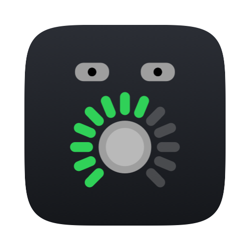
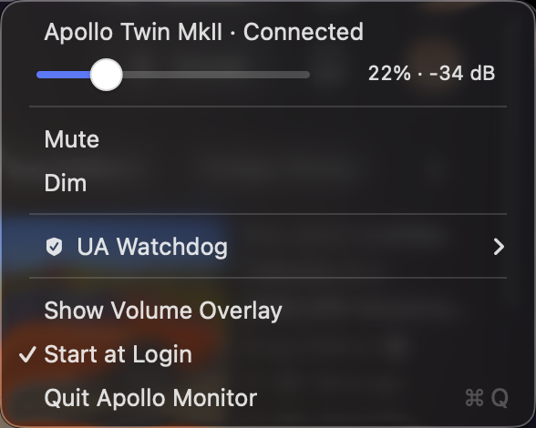

# Apollo Monitor

<p align="center"></p>

<p align="center">Part of <strong><a href="https://menumon.nicksmith.software">Menumon</a></strong>.</p>

**Version 1.2.0** · [Changelog](https://github.com/nicholaspsmith/apollo-monitor-menubar/releases)



A macOS menu-bar control for the **monitor output level of an Apollo audio
interface**: a live level icon, a slider, connection status, the Mac's
**volume and mute keys** driving the monitor level in 1 dB steps, and an
on-screen volume overlay.

Built on [StatusItemKit](https://github.com/nicholaspsmith/StatusItemKit) and
[HotkeyKit](https://github.com/nicholaspsmith/HotkeyKit).

```
┌────────────────────────────────┐
│  Apollo Twin MkII · Connected  │
│  ───●───────────  13% · -47 dB │
├────────────────────────────────┤
│  Mute                          │
│  Dim                           │
├────────────────────────────────┤
│  Show Volume Overlay         ✓ │
│  Icon                        ▸ │
│  Start at Login              ✓ │
├────────────────────────────────┤
│  Version X.Y.Z                 │
│  Quit Apollo Monitor        ⌘Q │
└────────────────────────────────┘
```

When relevant the menu also shows [engine recovery](#engine-recovery) status
and **Restart UA Mixer Engine**, **⚠ Grant Accessibility…**, or "Volume keys:
system output isn't the Apollo".

## The menu-bar icon


An Apollo interface's face: the monitor knob's ring of ticks is the mouth and
two square buttons are the eyes. The ticks light green with the monitor level,
from bottom-left over the top to bottom-right (shown above at 15%, 50%, 90%
and offline). It follows the level live, including changes made on the
hardware knob or in the Console app.

It turns **grey whenever the level cannot be changed**: the mixer engine is not
running, the Apollo is offline, the output is muted, or Accessibility has not
been granted. The menu says which.

**Icon ▸ Arc** shows a green level arc instead; **Icon ▸ Apollo** restores the
face. Both are full-colour images, not templates, so they keep their colour
when the menu opens.

## Why this exists

The Apollo exposes **no volume control to Core Audio**: no
`kAudioDevicePropertyVolumeScalar`, no virtual main volume, and
`osascript -e 'get volume settings'` reports `output volume: missing value`. The
macOS volume keys, `set volume`, and hardware-volume utilities therefore do
nothing to it, even when it is the default output. The Console app has no
AppleScript dictionary or volume key commands. Without this app, the level
can only be changed in Console or on the knob.

## Requirements

- macOS 13+
- An Apollo interface with its desktop software (the Console app and its mixer
  engine) installed
- Xcode Command Line Tools (Swift 5.9+) to build
- **Accessibility** permission for the volume keys (not needed for the menu,
  slider, or `--step`)

## Install

```sh
git clone https://github.com/nicholaspsmith/StatusItemKit.git
git clone https://github.com/nicholaspsmith/HotkeyKit.git
git clone https://github.com/nicholaspsmith/apollo-monitor-menubar.git
cd apollo-monitor-menubar
../StatusItemKit/scripts/setup-signing.sh   # once
./install.sh
```

The three checkouts must be siblings: `Package.swift` uses local paths.

Run `setup-signing.sh` once before installing. macOS keys the Accessibility
grant to the app's code hash; an ad-hoc signature changes it on every build, so
without a stable signing identity you re-approve the app after each rebuild.

Run the tests with `swift test`.

## Usage

| | |
|---|---|
| **Volume up / down keys** | Monitor level ±1 dB per press; a held key accelerates |
| **Mute key** | Mutes and unmutes the monitor output |
| Click the icon | Slider, Mute, Dim, [engine recovery](#engine-recovery) when needed, overlay switch, Icon, Start at Login |
| `ApolloMonitor --step up\|down` | Adjust once and exit; needs no Accessibility |
| `ApolloMonitor --login on\|off\|status` | Start at Login from the shell (what `install.sh` runs when you say yes) |

### The volume keys

The app intercepts the Mac's volume and mute keys through a `CGEventTap` and
swallows them, which also suppresses the system HUD (for the Apollo it can only
show a greyed-out slider). Feedback comes from the menu-bar icon and the
overlay.

- **Up / down** step 1 dB per press, snapped to whole dB, so a level the
  hardware knob left on a fraction lands back on an integer. A held key
  accelerates: 1 dB for the first five repeats, then 2 dB, then 3 dB from the
  twelfth. macOS repeats media keys about every 150 ms, so this crosses
  −60 → 0 dB in about two seconds.
- **Mute** toggles the Apollo's `Mute` and does not repeat on hold. Mute changes
  also show the overlay.
- Bound to `NX_KEYTYPE_SOUND_UP` / `_DOWN` / `MUTE` (0, 1 and 7), each with and
  without the `fn` modifier, since some keyboards report the function layer on
  media keys.

**Pass-through.** The keys are intercepted only while the Apollo is **the
default output device** and the engine is reachable. Otherwise they pass
through to macOS unchanged, and the menu says so.

`--step` is the alternative to granting Accessibility: bind it from Shortcuts,
Karabiner, or anything else that can run a command.

### The overlay

A replacement for the system volume HUD, top-right below the menu bar: device
name, a level bar and the exact dB. It is a non-activating borderless panel
that ignores the mouse and fades after 1.4 s.

It follows the *level*, not the keypress, so turning the hardware knob or
Console's fader shows it too. Dragging the menu slider does not. **Show Volume
Overlay** turns it off and on; the choice persists.

The panel is rebuilt on wake, on screen-configuration changes, and after five
minutes unused. A long-running instance was once seen to stop putting the
window on screen despite `show()` running normally; the cause was never
reproduced, and a process cannot reliably check whether its own window is
visible, so the panel is replaced at those points instead. Rebuilding takes
under a millisecond and never happens during a run of key presses.

### Responsiveness

The event-tap callback only does arithmetic and a socket write; drawing is
deferred to the next main-queue turn, so a keystroke never waits on a redraw
and the system never disables the tap for being slow. The state changes one
press produces (optimistic write, the engine's dB echo, its tapered echo)
collapse into one UI pass. The dB readout moves immediately; the slider waits
for the engine's echo (~8 ms), because only the engine knows which knob
position the level landed on.

## How it works

`UA Mixer Engine.app` starts at login and listens on **TCP `127.0.0.1:4710`**,
speaking an undocumented path-based "StateTree" protocol. The Console app uses
the same channel, and it listens whether or not the Console window is open.

- Messages are `<verb> <path> [value]` terminated by a **NUL byte** (`0x00`).
  A newline is silently ignored, which makes the socket look dead.
- Verbs: `get`, `set`, `subscribe`, `unsubscribe`.
- Replies are JSON: `{"path": …, "data": …}` or `{"path": …, "error": …}`.
- `subscribe` returns the current value **and pushes every later change**, so
  the app follows the hardware knob and Console's fader with no polling.
- A `get` round-trips in ~3 ms; a `set` is echoed back in ~8 ms.

Paths used (device 0; the `MONITOR` output is resolved by name, not hardcoded):

| Path | Type |
|---|---|
| `/devices/0/DeviceName/value` | string, e.g. `"Apollo Twin MkII"` |
| `/devices/0/DeviceOnline/value` | bool |
| `…/outputs/<n>/CRMonitorLevelTapered/value` | float 0.0–1.0, knob position |
| `…/outputs/<n>/CRMonitorLevel/value` | float −96.0–0.0, dB |
| `…/outputs/<n>/Mute/value`, `…/DimOn/value` | bool |

0% is −96 dB (silence), 100% is 0 dB (unity).

### Tapered position vs dB

`CRMonitorLevelTapered` **snaps to a 1/54 grid** (a requested `0.05` reads back
as `0.055556`) and holds the same value across roughly 2 dB. It reports the
knob's position coarsely. `CRMonitorLevel` (dB) is the fine-grained control:
`-29.5`, `-29.1` and `-27.25` all round-trip exactly while the tapered value
stays at 14/54. So:

- **The volume keys set dB.** At normal listening levels 1 dB is about 0.9% of
  knob travel, finer than the 55 tapered positions can express.
- **The slider sets knob position**, like Console's knob. It always displays
  the position the engine reports, unquantised. Dragging writes whole percents;
  the engine snaps them to its grid and pushes back the real position, which
  the slider then shows (a drop at 26% can settle at 14/54).

Both paths compute an absolute value (a dB target, or a position from the
mouse), so nothing accumulates and no step ladder is needed to prevent drift.
Conversions and drag geometry are
[unit-tested](Tests/ApolloMonitorCoreTests/KnobPositionTests.swift).

## Engine recovery

After a deep sleep the mixer engine can re-mount the Thunderbolt bus with zero
devices and leave `DeviceOnline` false indefinitely, while macOS still lists
the Apollo as a Core Audio device. Every client, Console included, then shows
the Apollo as disconnected, and the slider and volume keys go grey.

The app watches for that combination (engine socket up, engine says offline, a
Universal Audio device present in Core Audio). After it has held for **60
seconds**, the app restarts the engine with `launchctl kickstart -k
gui/<uid>/com.uaudio.ua_mixer_engine`. The engine listens again within a couple
of seconds, re-enumerates, and the app reconnects. A notification reports it,
and for the next hour the menu shows *Mixer engine restarted HH:MM to recover
the Apollo*.

Guards:

- **One attempt per offline episode.** Nothing more happens until the device
  comes online and goes offline again.
- **Ten-minute cooldown** between attempts, so a flapping device cannot cause
  a restart loop.
- **Wake restarts the 60 s clock**, so the engine's own post-sleep
  re-enumeration (tens of seconds) is never pre-empted.
- An unplugged Apollo has no Core Audio device, so nothing is restarted.

While the condition holds, the menu shows it with a countdown and offers
**Restart UA Mixer Engine** to skip the wait; the item also appears whenever
the engine is up but the level cannot be changed. The decision logic is
`EngineRecoveryPolicy` in `ApolloMonitorCore`, pure and unit-tested.

A mixer engine that is busy or not running at all is handled by the UA
watchdog in [Mac Daddy](https://github.com/nicholaspsmith/mac-daddy-menubar),
not this app.

## Supported interfaces

Apollo Monitor is an independent, unofficial project. It is not affiliated
with, endorsed by, or supported by Universal Audio; Apollo is their trademark.

The app never talks to the hardware, only to the mixer engine the Console app
runs on the Mac, so any Apollo driven by that engine should work:

| Interface | Status |
|-----------|--------|
| Universal Audio Apollo Twin MkII | Tested (Console 3, 1.3.0, macOS 26) |
| Universal Audio Apollo Twin X, Apollo Solo | Untested; same engine and protocol, expected to work |
| Universal Audio Apollo x4, x6, x8, x8p, x16 | Untested; same engine, expected to work |
| Earlier rack Apollo 8, 8p, 16 | Untested; same engine, expected to work |
| Any model that only works over USB on Windows | Not applicable — no Mac mixer engine |

Only the first device (`/devices/0`) is controlled. Reports from untested
models are welcome.

## Diagnostics

```sh
/usr/bin/log stream --predicate 'subsystem == "com.nicholaspsmith.ApolloMonitor"'
```

Logs the socket state, the resolved MONITOR output, device online/offline,
whether Core Audio has a Universal Audio device, every level change, and every
[engine restart](#engine-recovery). Use the absolute path: `log` is a zsh
builtin.

## Caveats

- The protocol is undocumented and unsupported; a vendor update could change it.
- Single device only (`/devices/0`); no surround, cue outputs, or preamp control.
- The 1/54 grid is what a Twin MkII reports. Other Apollos may differ; the step
  arithmetic does not depend on the exact divisor.

The original design is in
[`docs/superpowers/specs/2026-07-29-apollo-monitor-menubar-design.md`](docs/superpowers/specs/2026-07-29-apollo-monitor-menubar-design.md).

## Releasing

Every push to `main` is a release. Before pushing, add a dated
`## [X.Y.Z] - YYYY-MM-DD` section to the top of [`CHANGELOG.md`](CHANGELOG.md)
(minor for features, patch for fixes; turn a waiting `## [Unreleased]` into
it). When it reaches `main`, GitHub tags `vX.Y.Z` and publishes the section as
a release titled `vX.Y.Z`. Without a new version:

- the `pre-push` hook refuses the push;
- a pull request **cannot merge** — `release / check` is required on `main`;
- a push that reaches `main` anyway fails the release workflow.

The one exception is `[no release]` in the tip commit's message, for changes
nothing a user runs (setup, CI, developer docs): it passes every check with no
version bump and no tag. Never tag or create a release by hand, and never
`gh pr merge --admin` past a failing check — fix the PR. After merging,
`git pull` for the tag and rebuild. `install.sh` re-arms the hook on a fresh
clone. See [StatusItemKit — Releases](https://github.com/nicholaspsmith/StatusItemKit#releases-every-push-is-one)
for the full rule.

## License

Copyright (c) 2026 Nicholas Smith. Licensed under the
[Mozilla Public License 2.0](LICENSE). You may use, modify, sell and
redistribute this software, including inside proprietary products, provided
the copyright notice and license stay on these files and any modified
versions of them are made available under the same license.

Versions obtained before 2026-09-20 were MIT-licensed and keep those terms.

## Why not a SwiftBar plugin?

This is a standalone `.app` built on [StatusItemKit](https://github.com/nicholaspsmith/StatusItemKit), not a script under a plugin host: no SwiftBar to install, a real AppKit menu instead of rendered stdout, event-driven updates instead of a re-run timer, and an icon that keeps its place in the bar. A live level icon, a slider inside the menu, and volume keys remapped through a `CGEventTap` all need a real app. The full comparison is in [StatusItemKit's README](https://github.com/nicholaspsmith/StatusItemKit#why-not-swiftbar).

## The menu-bar suite

Part of a suite of macOS menu-bar apps that share one framework, one
build-and-sign script, and one installer. They are designed to sit in the
same bar together: consistent menus, a common **Icon** picker, and cooperative
hiding so no icon strands another.

| App | What it does |
|---|---|
| [Claude Usage](https://github.com/nicholaspsmith/claude-usage-menubar) | Claude Code plan limits, resets, and live agent sessions |
| **Apollo Monitor** | Apollo audio-interface monitor level |
| [Battery Time](https://github.com/nicholaspsmith/battery-time-menubar) | Time remaining, power mode, and 24h usage |
| [VPN & DNS](https://github.com/nicholaspsmith/vpn-dns-menubar) | An iguana for Mullvad + Tailscale state, with a DNS watcher |
| [Mac Daddy](https://github.com/nicholaspsmith/mac-daddy-menubar) | Kills media trackers, trashes stale downloads, reaps hung processes, watches the UA mixer engine, and sweats as your process count climbs |
| [KeyLight](https://github.com/nicholaspsmith/keylight-menubar) | Ctrl+brightness keys remapped to keyboard backlight |
| [MacRecorder](https://github.com/nicholaspsmith/MacRecorder) | Screen recording with system audio |
| [Barn](https://github.com/nicholaspsmith/menubar-barn) | macOS 26 and earlier only: hides a block of status icons by width. On macOS 27 use System Settings ▸ Menu Bar |

| Framework | |
|---|---|
| [StatusItemKit](https://github.com/nicholaspsmith/StatusItemKit) | Status-item lifecycle, polling, menus, meter icons, the shared Icon picker |
| [HotkeyKit](https://github.com/nicholaspsmith/HotkeyKit) | CGEventTap engine for intercepting and remapping global keys |

Install the whole suite on a fresh Mac with
[macOS Dev Environment Setup](https://github.com/nicholaspsmith/MacOS-Dev-Environment-Setup):

```bash
git clone https://github.com/nicholaspsmith/MacOS-Dev-Environment-Setup.git
cd MacOS-Dev-Environment-Setup && ./bootstrap.sh --all
```
